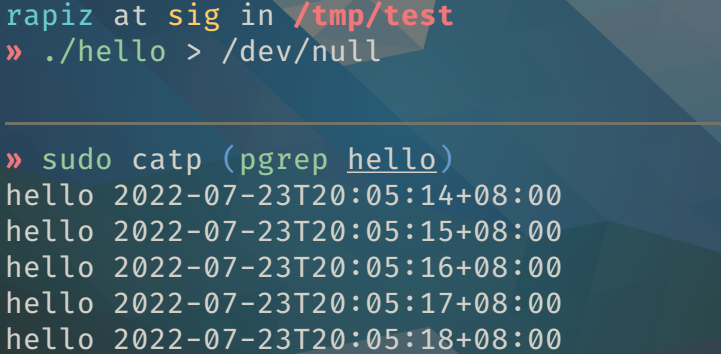

# catp

Print the output of *a running process*


```plain
catp 0.1.0
Print the output of a running process

USAGE:
    catp [OPTIONS] <PID>

ARGS:
    <PID>    PID of the process to print

OPTIONS:
    -f, --fd <FD>    File descriptor to print [default: 1]
    -h, --help       Print help information
    -v, --verbose    Print more verbose information to stderr
    -V, --version    Print version information
```

## Why?

Sometimes a process is redirected to `/dev/null` because we don't expect to check its output.
However, we may regret that decision and don't want to restart the process. Or we just don't know where a running process is printing to. Then just type `catp`!

## How It Works

`catp` uses `ptrace` to intercept syscall and extracts data from the syscall `write`.
So it should work for most applications. It's not wise to `catp` an IO-sensitive application for a long time since it slows down the syscall.

`catp` requires `ptrace` privilege to run, which in most systems means root.

## Platform

Currently only x86_64 Linux is supported.
